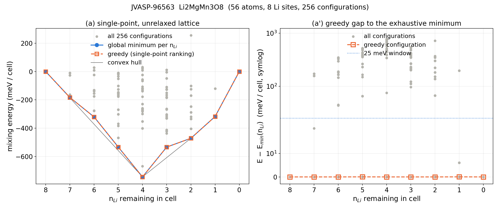

# Exhaustive Li-vacancy enumeration vs. greedy ALIGNN-FF ranking (R1.M6)

Generated by `enumerate.py`.  For each cell every subset of the Li sites (2^8 = 256 configurations, no symmetry reduction) was evaluated with ALIGNN-FF (`alignnff_wt01`, same calculator as `dft_prep._alignn_energy`).  `greedy_sp` is the `get_next_vacancy` heuristic applied to the rigid step_00 cell; `greedy_contcar` is the production loop (rank single points on the previous step's relaxed structure, relax the winner, repeat) with ALIGNN-FF standing in for VASP.  Gaps are energy of the greedy configuration minus the exhaustive minimum at the same n_Li; `found` means gap <= 1 meV/cell.  Voltages use the ALIGNN-FF bcc-Li reference computed with the same calculator (values listed per system); screen.py instead uses jarvis `unary_energy('Li') = -0.925` eV/atom (JARVIS OptB88-vdW DFT) and dft_prep.py uses in-house Li_sv DFT values; a different reference shifts all voltages by a constant and changes no gap or ranking.

## JVASP-2017  LiCoO2

- cell: 2x2x2 supercell, 32 atoms, 8 Li sites, 8 formula units per cell; reference POSCAR match: True (/Users/jaelee/Desktop/work/batterymat_jae/batterymat_jae/screening_cathode/dft_inputs/JVASP-2017-LCO/supercell_2x2x2/step_00_Li8/POSCAR)
- Li reference (ALIGNN-FF, bcc Li JVASP-913): single-point -0.9364 eV/atom (level a), relaxed -0.9628 eV/atom (level b); screen.py unary_energy = -0.925; dft_prep DFT refs {'pbe': -1.9031, 'optb88vdw': -0.9646}
- relax settings: ASE FIRE on ExpCellFilter (ions + cell), fmax 0.05 eV/A, step cap 200, mode requested `minimal`, effective `none`; timing: single-point 2.33 s/config, level (a) wall 5.6 min, first-10 relax probe nan s -> projected nan h for 256, level (b) wall 0.00 h on 4 workers

- force-field sanity probe (pristine cell): analytic fmax 37.2 eV/A, mean |F| 15.1 eV/A on a DFT-relaxed structure; energy change for displacing Li site 0 by 0.005/0.01/0.02/0.05/0.1 A: +33/+124/+109/+380/+411 meV/cell; 12th/13th-neighbour distances: Li 2.838/2.845 A, Co 2.838/2.845 A, Co 2.838/2.845 A
- analytic vs finite-difference forces (eV/A): Li0 h=0.002: analytic (-0.75, -1.53, -4.84) FD (0.01, -0.06, -0.23); Li0 h=0.01: analytic (-0.75, -1.53, -4.84) FD (-0.90, -0.31, 0.65); Co8 h=0.002: analytic (-1.30, 0.30, 3.70) FD (-0.34, 0.00, 0.37); Co8 h=0.01: analytic (-1.30, 0.30, 3.70) FD (-0.78, -0.11, 0.29); Co9 h=0.002: analytic (0.37, -0.58, -15.29) FD (0.64, -0.04, -0.99); Co9 h=0.01: analytic (0.37, -0.58, -15.29) FD (-0.15, -0.05, -0.94)

### Level (a): single-point energies, unrelaxed lattice

Noise floor: the 8 single-vacancy configurations at n_Li = 7 are all symmetry-equivalent in this cell, yet ALIGNN-FF spreads them over 58.8 meV/cell (8 distinct energies); gaps below this value are within the model's own symmetry-breaking noise.  'rank' counts configurations with strictly lower energy plus one, so a rank of 2 with a 0.0 meV gap is a degenerate tie.

| n_Li | configs | E_min (eV) | greedy E (eV) | gap meV/cell | gap meV/f.u. | greedy found min | rank of greedy | within 25 meV | distinct levels | degenerate w/ min | spread max-min meV |
|---|---|---|---|---|---|---|---|---|---|---|---|
| 8 | 1 | -147.9200 | -147.9200 | 0.0 | 0.0 | yes | 1/1 | 1 | 1 | 1 | 0.0 |
| 7 | 8 | -143.7976 | -143.7976 | 0.0 | 0.0 | yes | 1/8 | 4 | 8 | 1 | 58.8 |
| 6 | 28 | -140.0966 | -140.0597 | 36.8 | 4.6 | NO | 3/28 | 2 | 25 | 2 | 822.7 |
| 5 | 56 | -135.7506 | -135.6803 | 70.3 | 8.8 | NO | 11/56 | 5 | 54 | 1 | 1091.4 |
| 4 | 70 | -131.2146 | -131.2146 | 0.0 | 0.0 | yes | 1/70 | 2 | 69 | 1 | 873.2 |
| 3 | 56 | -126.2784 | -126.2344 | 44.0 | 5.5 | NO | 12/56 | 9 | 51 | 1 | 305.2 |
| 2 | 28 | -121.3494 | -121.2726 | 76.8 | 9.6 | NO | 4/28 | 3 | 27 | 1 | 719.7 |
| 1 | 8 | -115.5613 | -115.4432 | 118.0 | 14.8 | NO | 6/8 | 1 | 8 | 1 | 161.0 |
| 0 | 1 | -109.4596 | -109.4596 | 0.0 | 0.0 | yes | 1/1 | 1 | 1 | 1 | 0.0 |

Path nesting (removed-set inclusion): greedy config at n_Li a subset of the global-min config at n_Li-1?  8→7: yes, 7→6: no, 6→5: no, 5→4: yes, 4→3: no, 3→2: no, 2→1: no, 1→0: yes
Global-min configs nested along a single path (min at n_Li a subset of min at n_Li-1)?  8→7: yes, 7→6: no, 6→5: no, 5→4: no, 4→3: no, 3→2: no, 2→1: no, 1→0: yes

| path | average voltage (V) | hull plateaus |
|---|---|---|
| greedy (single-point ranking) | 3.871 | 2.994 V (x 1.000→0.750); 3.443 V (x 0.750→0.625); 3.529 V (x 0.625→0.500); 4.035 V (x 0.500→0.250); 4.893 V (x 0.250→0.125); 5.047 V (x 0.125→0.000) |
| global minimum per composition | 3.871 | 2.975 V (x 1.000→0.750); 3.410 V (x 0.750→0.625); 3.600 V (x 0.625→0.500); 3.996 V (x 0.500→0.250); 4.852 V (x 0.250→0.125); 5.165 V (x 0.125→0.000) |

Step voltages (V) n_Li 8→7 ... 1→0, greedy: 3.186, 2.801, 3.443, 3.529, 4.044, 4.025, 4.893, 5.047
Step voltages (V) n_Li 8→7 ... 1→0, global-min: 3.186, 2.765, 3.410, 3.600, 4.000, 3.993, 4.852, 5.165


## JVASP-96563  Li2MgMn3O8

- cell: 1x1x1 supercell, 56 atoms, 8 Li sites, 4 formula units per cell; reference POSCAR match: True (/Users/jaelee/Desktop/archive/hpc_runs/dft3d_result/vasp/POSCAR-JVASP-96563.vasp)
- Li reference (ALIGNN-FF, bcc Li JVASP-913): single-point -0.9364 eV/atom (level a), relaxed -0.9628 eV/atom (level b); screen.py unary_energy = -0.925; dft_prep DFT refs {'pbe': -1.9031, 'optb88vdw': -0.9646}
- relax settings: ASE FIRE on ExpCellFilter (ions + cell), fmax 0.05 eV/A, step cap 200, mode requested `minimal`, effective `none`; timing: single-point 2.80 s/config, level (a) wall 7.1 min, first-10 relax probe nan s -> projected nan h for 256, level (b) wall 0.00 h on 3 workers

- force-field sanity probe (pristine cell): analytic fmax 31.7 eV/A, mean |F| 11.6 eV/A on a DFT-relaxed structure; energy change for displacing Li site 0 by 0.005/0.01/0.02/0.05/0.1 A: -13/-13/-12/-35/-23 meV/cell; 12th/13th-neighbour distances: Li 3.390/3.390 A, Mg 2.932/3.385 A, Mg 2.932/3.385 A
- analytic vs finite-difference forces (eV/A): Li0 h=0.002: analytic (3.31, 1.34, -2.90) FD (0.79, -0.42, -0.47); Li0 h=0.01: analytic (3.31, 1.34, -2.90) FD (0.58, 0.97, -1.28); Mg8 h=0.002: analytic (3.66, 3.66, 3.66) FD (0.21, 0.21, 0.21); Mg8 h=0.01: analytic (3.66, 3.66, 3.66) FD (-0.68, -0.68, -0.68); Mg9 h=0.002: analytic (-8.20, 9.31, 0.66) FD (-0.63, 0.69, 0.06); Mg9 h=0.01: analytic (-8.20, 9.31, 0.66) FD (-1.55, 2.51, -0.00)

### Level (a): single-point energies, unrelaxed lattice

Noise floor: the 8 single-vacancy configurations at n_Li = 7 are all symmetry-equivalent in this cell, yet ALIGNN-FF spreads them over 172.5 meV/cell (6 distinct energies); gaps below this value are within the model's own symmetry-breaking noise.  'rank' counts configurations with strictly lower energy plus one, so a rank of 2 with a 0.0 meV gap is a degenerate tie.

| n_Li | configs | E_min (eV) | greedy E (eV) | gap meV/cell | gap meV/f.u. | greedy found min | rank of greedy | within 25 meV | distinct levels | degenerate w/ min | spread max-min meV |
|---|---|---|---|---|---|---|---|---|---|---|---|
| 8 | 1 | -296.9802 | -296.9802 | 0.0 | 0.0 | yes | 1/1 | 1 | 1 | 1 | 0.0 |
| 7 | 8 | -291.9698 | -291.9698 | 0.0 | 0.0 | yes | 1/8 | 2 | 6 | 1 | 172.5 |
| 6 | 28 | -286.9137 | -286.9137 | 0.0 | 0.0 | yes | 1/28 | 3 | 13 | 3 | 348.4 |
| 5 | 56 | -281.9329 | -281.9329 | 0.0 | 0.0 | yes | 2/56 | 3 | 21 | 3 | 523.6 |
| 4 | 70 | -276.9502 | -276.9502 | 0.0 | 0.0 | yes | 1/70 | 1 | 28 | 1 | 775.6 |
| 3 | 56 | -271.5457 | -271.5457 | 0.0 | 0.0 | yes | 1/56 | 1 | 21 | 1 | 544.8 |
| 2 | 28 | -266.2902 | -266.2902 | 0.0 | 0.0 | yes | 1/28 | 3 | 11 | 3 | 726.7 |
| 1 | 8 | -260.9430 | -260.9430 | 0.0 | 0.0 | yes | 2/8 | 6 | 3 | 3 | 197.1 |
| 0 | 1 | -255.4316 | -255.4316 | 0.0 | 0.0 | yes | 1/1 | 1 | 1 | 1 | 0.0 |

Path nesting (removed-set inclusion): greedy config at n_Li a subset of the global-min config at n_Li-1?  8→7: yes, 7→6: yes, 6→5: no, 5→4: yes, 4→3: yes, 3→2: yes, 2→1: no, 1→0: yes
Global-min configs nested along a single path (min at n_Li a subset of min at n_Li-1)?  8→7: yes, 7→6: yes, 6→5: no, 5→4: yes, 4→3: yes, 3→2: yes, 2→1: no, 1→0: yes

| path | average voltage (V) | hull plateaus |
|---|---|---|
| greedy (single-point ranking) | 4.257 | 4.071 V (x 1.000→0.500); 4.394 V (x 0.500→0.250); 4.411 V (x 0.250→0.125); 4.575 V (x 0.125→0.000) |
| global minimum per composition | 4.257 | 4.071 V (x 1.000→0.500); 4.394 V (x 0.500→0.250); 4.411 V (x 0.250→0.125); 4.575 V (x 0.125→0.000) |

Step voltages (V) n_Li 8→7 ... 1→0, greedy: 4.074, 4.120, 4.044, 4.046, 4.468, 4.319, 4.411, 4.575
Step voltages (V) n_Li 8→7 ... 1→0, global-min: 4.074, 4.120, 4.044, 4.046, 4.468, 4.319, 4.411, 4.575



## Status (2026-09-24) and how to finish level (b) on a cluster

**Completed on disk.** Level (a) is complete for both systems: all 256 Li-vacancy configurations per cell
(single-point ALIGNN-FF energies, no symmetry reduction) are in `results_JVASP-2017.json` and
`results_JVASP-96563.json` under `configs[mask].e_sp` (mask bit j set = Li site `li_indices[j]` removed).
Each JSON also holds `greedy_sp_path`, `analysis.level_a_single_point` (per-composition gaps, ranks,
25 meV counts, nesting checks, step/hull voltages), the ALIGNN-FF Li reference (`e_li_reference`), and the
force-field sanity probe (`force_probe`).  The two PNGs and the tables above were generated from these files.

**Not completed.** Level (b) (ALIGNN-FF FIRE relaxation) was stopped before any relaxed energy was written:
`configs[*].e_relax` is absent for every configuration in both files, and no `greedy_contcar_path` exists.
Local runs were halted on instruction; the projected cost of relaxing all 256 configurations with a 300-step
cap was ~19 h (LCO, 31-32 atoms, ~3.5 s per FIRE step) and ~30 h (Li2MgMn3O8, 55-56 atoms, ~5.5 s per step)
on 4 single-thread CPU workers, so the fallback (per-composition SP-minimum + greedy configurations only,
14 for LCO and 11 for Li2MgMn3O8, plus the relax-then-rank greedy loop) had been launched with a 200-step cap
and was killed before its first checkpoint.  Note the caveat in the docstring/force probe: with this
alignn build (2025.4.1) and the `alignnff_wt01` checkpoint the analytic forces do not match finite
differences and the energy is discontinuous at 0.01 A, so FIRE does not converge; a relaxed-level
comparison should be treated as a diagnostic unless the force path is fixed first.

**To finish on a cluster** (no changes to the script needed):
```
export KMP_DUPLICATE_LIB_OK=TRUE OMP_NUM_THREADS=1        # needed on the Mac; harmless elsewhere
python enumerate.py JVASP-2017  --resume --relax all --workers N [--steps 300]
python enumerate.py JVASP-96563 --resume --relax all --workers N --ref-poscar <POSCAR-JVASP-96563.vasp>
python enumerate.py --summary                              # rebuild tables + PNGs
```
`--resume` reuses the 256 single-point energies already in the JSON and only runs the missing relaxations,
checkpointing every 8 relaxations; `--relax minimal` runs only the SP-minimum + greedy set; `--budget-hours`
controls the `auto` fallback.  Requirements: the alignn env (torch + dgl + jarvis-tools + ase), the
`alignnff_wt01` weights (`wt01_path()`), and the JARVIS dft_3d cache (`--cache`, a pickled list of dicts
with `jid` and `atoms`; JVASP-913 must be present for the Li reference).  Each worker is single-threaded and
holds one calculator (~1 GB); 256 relaxations x 300 steps is ~60 CPU-h (LCO) and ~110 CPU-h (Li2MgMn3O8)
at the Mac per-step rates, so 32 workers finish both in roughly 3-4 h wall.
