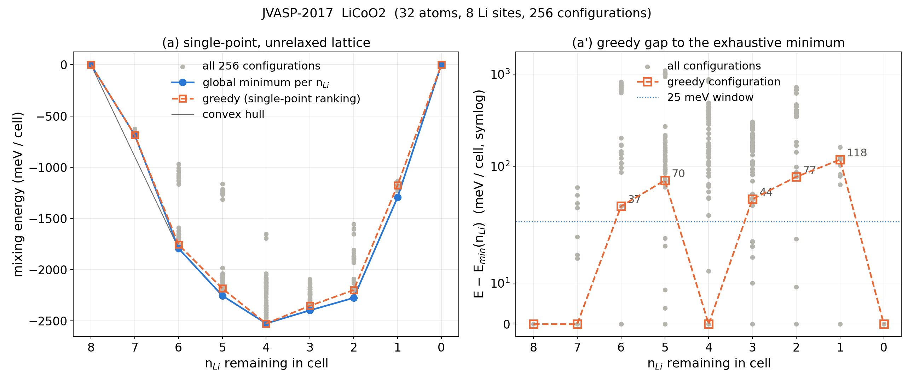

# Exhaustive Li-vacancy enumeration vs. greedy ALIGNN-FF ranking (R1.M6)

> **Note (2026-10-02).** `results_JVASP-*.json` and the level (b) section below are from the
> atomgptlab run (alignn build 12ae44e), which is the source of the relaxed-level numbers in the
> paper: 3 of 512 relaxations converged (3 for LiCoO2, 0 for Li2MgMn3O8), median residual force
> 0.97 and 1.24 eV/A after 300 steps, median energy drop 0.47 and 0.86 eV per cell, and
> pristine-cell forces of 2.3 and 2.0 eV/A. The "~10 eV/A" and "10-20x" figures in the caveat
> below describe an earlier local build whose forces are unreliable; the conclusion (no
> force-converged ALIGNN-FF relaxation) is the same. `results_JVASP-*_mac.json` are the local
> level (a) runs used for the figures; single-point energies of the two runs agree to 1e-4 eV,
> and the rank of the greedy configuration at n_Li = 6 is 4/28 here against 3/28 there.

Generated by `enumerate.py`.  For each cell every subset of the Li sites (2^8 = 256 configurations, no symmetry reduction) was evaluated with ALIGNN-FF (`alignnff_wt01`, same calculator as `dft_prep._alignn_energy`).  `greedy_sp` is the `get_next_vacancy` heuristic applied to the rigid step_00 cell; `greedy_contcar` is the production loop (rank single points on the previous step's relaxed structure, relax the winner, repeat) with ALIGNN-FF standing in for VASP.  Gaps are energy of the greedy configuration minus the exhaustive minimum at the same n_Li; `found` means gap <= 1 meV/cell.  Voltages use the ALIGNN-FF bcc-Li reference computed with the same calculator (values listed per system); screen.py instead uses jarvis `unary_energy('Li') = -0.925` eV/atom (JARVIS OptB88-vdW DFT) and dft_prep.py uses in-house Li_sv DFT values; a different reference shifts all voltages by a constant and changes no gap or ranking.

## JVASP-2017  LiCoO2

- cell: 2x2x2 supercell, 32 atoms, 8 Li sites, 8 formula units per cell; reference POSCAR match: True (/data/jlee859/revision/dft_inputs/JVASP-2017-LCO-B88/supercell_2x2x2/step_00_Li8/POSCAR)
- Li reference (ALIGNN-FF, bcc Li JVASP-913): single-point -0.9364 eV/atom (level a), relaxed -0.9753 eV/atom (level b); screen.py unary_energy = -0.925; dft_prep DFT refs {'pbe': -1.9031, 'optb88vdw': -0.9646}
- relax settings: ASE FIRE on ExpCellFilter (ions + cell), fmax 0.05 eV/A, step cap 300, mode requested `all`, effective `none`; timing: single-point 1.61 s/config, level (a) wall 1.4 min, first-10 relax probe 3985 s -> projected 28.34 h for 256, level (b) wall 7.69 h on 64 workers

- force-field sanity probe (pristine cell): analytic fmax 2.3 eV/A, mean |F| 0.9 eV/A on a DFT-relaxed structure; energy change for displacing Li site 0 by 0.005/0.01/0.02/0.05/0.1 A: +33/+124/+109/+380/+411 meV/cell; 12th/13th-neighbour distances: Li 2.838/2.845 A, Co 2.838/2.845 A, Co 2.838/2.845 A
- analytic vs finite-difference forces (eV/A): Li0 h=0.002: analytic (-0.05, -0.10, -0.30) FD (0.00, -0.06, -0.22); Li0 h=0.01: analytic (-0.05, -0.10, -0.30) FD (-0.90, -0.31, 0.65); Co8 h=0.002: analytic (-0.08, 0.02, 0.23) FD (-0.34, -0.00, 0.36); Co8 h=0.01: analytic (-0.08, 0.02, 0.23) FD (-0.78, -0.10, 0.29); Co9 h=0.002: analytic (0.02, -0.04, -0.96) FD (0.63, -0.03, -0.99); Co9 h=0.01: analytic (0.02, -0.04, -0.96) FD (-0.15, -0.05, -0.94)

### Level (a): single-point energies, unrelaxed lattice

Noise floor: the 8 single-vacancy configurations at n_Li = 7 are all symmetry-equivalent in this cell, yet ALIGNN-FF spreads them over 58.8 meV/cell (8 distinct energies); gaps below this value are within the model's own symmetry-breaking noise.  'rank' counts configurations with strictly lower energy plus one, so a rank of 2 with a 0.0 meV gap is a degenerate tie.

| n_Li | configs | E_min (eV) | greedy E (eV) | gap meV/cell | gap meV/f.u. | greedy found min | rank of greedy | within 25 meV | distinct levels | degenerate w/ min | spread max-min meV |
|---|---|---|---|---|---|---|---|---|---|---|---|
| 8 | 1 | -147.9200 | -147.9200 | 0.0 | 0.0 | yes | 1/1 | 1 | 1 | 1 | 0.0 |
| 7 | 8 | -143.7976 | -143.7976 | 0.0 | 0.0 | yes | 1/8 | 4 | 8 | 1 | 58.8 |
| 6 | 28 | -140.0966 | -140.0597 | 36.9 | 4.6 | NO | 4/28 | 2 | 25 | 2 | 822.7 |
| 5 | 56 | -135.7506 | -135.6803 | 70.3 | 8.8 | NO | 11/56 | 5 | 54 | 1 | 1091.4 |
| 4 | 70 | -131.2146 | -131.2146 | 0.0 | 0.0 | yes | 1/70 | 2 | 69 | 1 | 873.2 |
| 3 | 56 | -126.2784 | -126.2344 | 44.0 | 5.5 | NO | 12/56 | 9 | 51 | 1 | 305.2 |
| 2 | 28 | -121.3494 | -121.2726 | 76.8 | 9.6 | NO | 4/28 | 3 | 27 | 1 | 719.7 |
| 1 | 8 | -115.5613 | -115.4432 | 118.0 | 14.8 | NO | 6/8 | 1 | 8 | 1 | 160.9 |
| 0 | 1 | -109.4596 | -109.4596 | 0.0 | 0.0 | yes | 1/1 | 1 | 1 | 1 | 0.0 |

Path nesting (removed-set inclusion): greedy config at n_Li a subset of the global-min config at n_Li-1?  8→7: yes, 7→6: no, 6→5: no, 5→4: yes, 4→3: no, 3→2: no, 2→1: no, 1→0: yes
Global-min configs nested along a single path (min at n_Li a subset of min at n_Li-1)?  8→7: yes, 7→6: no, 6→5: no, 5→4: no, 4→3: no, 3→2: no, 2→1: no, 1→0: yes

| path | average voltage (V) | hull plateaus |
|---|---|---|
| greedy (single-point ranking) | 3.871 | 2.994 V (x 1.000→0.750); 3.443 V (x 0.750→0.625); 3.529 V (x 0.625→0.500); 4.035 V (x 0.500→0.250); 4.893 V (x 0.250→0.125); 5.047 V (x 0.125→0.000) |
| global minimum per composition | 3.871 | 2.975 V (x 1.000→0.750); 3.410 V (x 0.750→0.625); 3.600 V (x 0.625→0.500); 3.996 V (x 0.500→0.250); 4.852 V (x 0.250→0.125); 5.165 V (x 0.125→0.000) |

Step voltages (V) n_Li 8→7 ... 1→0, greedy: 3.186, 2.801, 3.443, 3.529, 4.044, 4.025, 4.893, 5.047
Step voltages (V) n_Li 8→7 ... 1→0, global-min: 3.186, 2.765, 3.410, 3.600, 4.000, 3.993, 4.852, 5.165

**Caveat.** The force-field sanity probe above shows that on these cells the calculator's analytic forces are 10-20x larger than, and inconsistent in sign with, finite-difference forces, and that the energy is discontinuous at the 0.01 A scale (degenerate neighbour shells at the max_neighbors=12 graph cutoff).  FIRE therefore never reaches fmax = 0.05 eV/A (the residual is ~10 eV/A) and the step cap always binds, so a 'relaxed' energy here is the energy after N FIRE steps on a rough surface, not a converged local minimum.  These numbers are reported as a diagnostic only; the production workflow never relaxes with ALIGNN-FF (VASP does the relaxation and ALIGNN-FF supplies only the single-point ranking of level (a)).

### Level (b): ALIGNN-FF relaxed (ions + cell), 256/256 configurations relaxed (complete)

- not converged within step cap: 253; relaxed/initial volume ratio range 0.884–0.989

| n_Li | relaxed configs | E_min relaxed (eV) | greedy_sp config: E (eV) / gap meV/cell / gap meV/f.u. / found / rank | greedy_contcar (chained): E (eV) / gap meV/cell / gap meV/f.u. / found | within 25 meV | distinct levels |
|---|---|---|---|---|---|---|
| 8 | 1 | -147.8516 | -147.8516 / 0.0 / 0.0 / yes / 1/1 | n/a | 1 | 1 |
| 7 | 8 | -144.6535 | -144.4559 / 197.6 / 24.7 / NO / 5/8 | n/a | 1 | 8 |
| 6 | 28 | -140.7322 | -140.4119 / 320.2 / 40.0 / NO / 14/28 | n/a | 2 | 28 |
| 5 | 56 | -136.3503 | -136.1678 / 182.6 / 22.8 / NO / 20/56 | n/a | 1 | 56 |
| 4 | 70 | -131.7992 | -131.5710 / 228.1 / 28.5 / NO / 12/70 | n/a | 1 | 70 |
| 3 | 56 | -126.8393 | -126.6375 / 201.8 / 25.2 / NO / 18/56 | n/a | 2 | 55 |
| 2 | 28 | -121.9420 | -121.7285 / 213.5 / 26.7 / NO / 8/28 | n/a | 1 | 28 |
| 1 | 8 | -116.3031 | -116.2543 / 48.8 / 6.1 / NO / 4/8 | n/a | 2 | 8 |
| 0 | 1 | -109.7081 | -109.7081 / 0.0 / 0.0 / yes / 1/1 | n/a | 1 | 1 |

Greedy re-run on the relaxed-energy table (hypothetical: rank by relaxed energy instead of single point): n_Li 8: gap 0.0 meV, n_Li 7: gap 0.0 meV, n_Li 6: gap 0.0 meV, n_Li 5: gap 127.7 meV, n_Li 4: gap 117.1 meV, n_Li 3: gap 91.6 meV, n_Li 2: gap 175.4 meV, n_Li 1: gap 16.4 meV, n_Li 0: gap 0.0 meV

Nesting vs relaxed global minima, greedy_sp: 8→7: yes, 7→6: no, 6→5: no, 5→4: no, 4→3: no, 3→2: no, 2→1: no, 1→0: yes
Nesting vs relaxed global minima, greedy_contcar: 8→7: yes, 7→6: no, 6→5: no, 5→4: no, 4→3: no, 3→2: no, 2→1: yes, 1→0: yes
Relaxed global-min configs nested along one path?  8→7: yes, 7→6: yes, 6→5: no, 5→4: no, 4→3: no, 3→2: no, 2→1: no, 1→0: yes

| path (relaxed energies) | average voltage (V) | hull plateaus |
|---|---|---|
| greedy_sp configs, relaxed | 3.793 | 2.420 V (x 1.000→0.875); 3.069 V (x 0.875→0.750); 3.269 V (x 0.750→0.625); 3.621 V (x 0.625→0.500); 3.946 V (x 0.500→0.250); 4.499 V (x 0.250→0.125); 5.571 V (x 0.125→0.000) |
| greedy relax-then-rank loop | 3.736 | 2.600 V (x 1.000→0.750); 3.412 V (x 0.750→0.500); 4.048 V (x 0.500→0.250); 4.741 V (x 0.250→0.125); 5.023 V (x 0.125→0.000) |
| global minimum per composition (relaxed) | 3.793 | 2.223 V (x 1.000→0.875); 2.946 V (x 0.875→0.750); 3.407 V (x 0.750→0.625); 3.576 V (x 0.625→0.500); 3.953 V (x 0.500→0.250); 4.664 V (x 0.250→0.125); 5.620 V (x 0.125→0.000) |

Step voltages (V) 8→7 ... 1→0, greedy loop: 2.791, 2.408, 3.502, 3.323, 4.111, 3.985, 4.741, 5.023
Step voltages (V) 8→7 ... 1→0, global-min: 2.223, 2.946, 3.407, 3.576, 3.985, 3.922, 4.664, 5.620

## JVASP-96563: results_JVASP-96563.json missing
